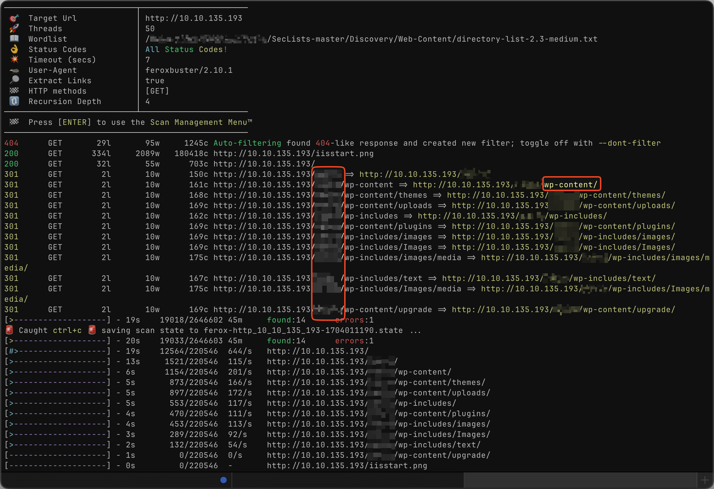
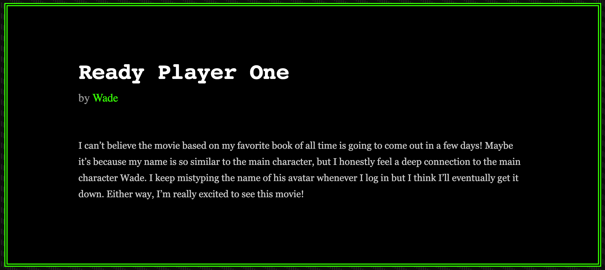

# Retro

Hi,

this is my Writeup for the [Retro](https://tryhackme.com/room/retro) box of
[TryHackMe](https://tryhackme.com). This box is the final room of the
[Offensive Pentesting](https://tryhackme.com/paths) path.

## Information gathering

First I have to know what is in front of me. So I started the machine and after
that start with nmap.

```bash
nmap -Pn -p- {{TARGET_MACHINE_IP}} -oN ports
```

That scan reveals two open ports:

- 80 which is running a webserver
- 3389 which is the rdp service

To get the services running, I use always this command:

```bash
nmap -Pn -sC -sV -p $(grep -Po '[0-9]*(?=/tcp)' ports | tr '\n' ', ') {{TARGET_MACHINE_IP}} -oN services
```

## A web server is running on the target. What is the hidden directory which the website lives on?

Tho answer this question, I used my favorit content discovery tool:
[feroxbuster](https://github.com/epi052/feroxbuster).

```bash
feroxbuster -w /PATH/TO/SECLISTS/Discovery/Web-Content/directory-list-2.3-medium.txt -u http://{{TARGET_MACHINE_IP}}
```



There is the (not so) hidden directory. And another interesting thing showed up:
`wp-content`. So there is wordpress running. Good to know.

## user.txt

This one is easier then I though. When looking around the blog entries from the
hidden directory, it clearly that the user `Wade` which has posted all the
entries, should be the username itself for wordpress and/or rdp session. I did
what every beginner would do: Start wpscan before further investigation.

```bash
wpscan --url http://{{TARGET_MACHINE_IP}}/retro/wp-login.php --usernames ["Wade"] --passwords /PATH/TO/rockyou.txt -t 200
```

But this take very long. While I'm writing this, it is still running since 25
min. I decided to read the blog entries, because I have to wait anyway. And
there it was! A suspecious blog entry:
 When I looked into the
comment section of this blog entry, I found the password in cleartext. And glad
I do so, because the cracking process was at this point after 41 min:

```
Trying [Wade] / carla Time: 00:41:33 <      > (1332 / 14344398)
```

But the password is at position >1'400'000. So 41 min for position 1'332. Spare
your time and read through the blog instead of bruteforcing it.

After that, I used the credentials to login via rdp with the user `Wade`. And it
was succesfully. Also login with the same credentials over wordpress login page
was succesfully. On the users desktop, there lays a file named user.txt, which
contains the flag.

## root.txt
